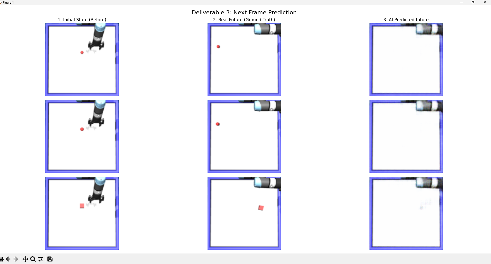

# CMPE 591 — Homework 1: Deep Learning for Robotics

This repository implements three deep learning models that predict robot push outcomes from top  camera images with using PyTorch and the MuJoCo based `Hw1Env` environment as instructed.

---

## Environment Setup

Install the required PyTorch + MuJoCo physics environment before running any script:

```bash
pip install torch numpy matplotlib
```

The code automatically detects and uses CUDA if available if not falls back to CPU.

---

## Step 1 — Data Generation

Collect 1000 samplesas initial image, action, resulting position, final image:

```bash
python generate_data.py
```

This saves `hw1_dataset.npz` to disk with the keys: `imgs_before`, `action`, `position_after`, `imgs_after`.

---

## Deliverable 1 — MLP: Position Prediction

**File:** `deliverable1_mlp.py`

A plain Multi-Layer Perceptron that takes a flattened image and a one-hot encoded action as input, and predicts the (x, y) position of the object after the push.

**Architecture:** `Input (49156) → Linear(256) → ReLU → Linear(128) → ReLU → Linear(2)`

```bash
python deliverable1_mlp.py   # runs train() then  test()
```

### Test Results

| Action | Predicted (x, y) | Real (x, y) | Euclidean Error |
|--------|-----------------|-------------|-----------------|
| -      | -               | -           | -               |

**Mean Euclidean Error:** *(run `python deliverable1_mlp.py` to populate)*

---

## Deliverable 2 — CNN: Position Prediction

**File:** `deliverable2_cnn.py`

A Convolutional Neural Network that extracts spatial features from the image, concatenates them with the action vector, and predicts the (x, y) position.

**Architecture:** `Conv2D stack → Flatten → Concat(action) → Linear(128) → Linear(2)`

```bash
python deliverable2_cnn.py   # runs train() then  test()
```

### Test Results

| Action | Predicted (x, y) | Real (x, y) | Euclidean Error |
|--------|-----------------|-------------|-----------------|
| -      | -               | -           | -               |

**Mean Euclidean Error:** *(run `python deliverable2_cnn.py` to populate)*

---

## Deliverable 3 — Image Predictor: Post-Action Image Reconstruction

**File:** `deliverable3_image.py`

An encoder-decoder (convolutional autoencoder) that reconstructs the full post-action image from the initial image and the executed action. The action is projected into a spatial 16×16 feature map and fused with the encoded image features at the bottleneck.

**Architecture:** `Encoder (3→32→64→128 channels) → Action Fusion → Decoder (129→64→32→3 channels)`

```bash
python deliverable3_image.py   # runs train() then test(), saves result as deliverable3_results.png
```

### Reconstructed Images vs. Ground Truth



**Mean Pixel MSE:** *(run `python deliverable3_image.py` to populate)*

---

## File Structure

```

generate_data.py           # Data collection script
deliverable1_mlp.py        # Deliverable 1: MLP position predictor
deliverable2_cnn.py        # Deliverable 2: CNN position predictor
deliverable3_image.py      # Deliverable 3: Image reconstruction
environment.py             # MuJoCo environment wrapper
homework1.py               # Environment entry point (Hw1Env)
hw1_dataset.npz            # Collected dataset (1000 samples)
mlp_model.pth              # Trained MLP weights
cnn_model.pth              # Trained CNN weights
image_predictor_model.pth  # Trained image predictor weights
```